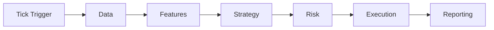

# ORCHESTRATION.md — Pipeline Blueprint

> **Status**: ACTIVE
> **PURPOSE**: Defines how the system will evolve from Monolith to Orchestrated Pipeline.

## 1. The Core Loop
The future system (and current `orchestrated` mode) follows this strictly sequential pipeline:

## 2. Pipeline Stages

### Stage 1: Data (Market Intake)
*   **Input**: `symbol`, `interval`.
*   **Output**: `runs/<id>/artifacts/candles.json`.
*   **Gate**: Candle Integrity (No gaps, fresh timestamp).

### Stage 2: Features (Analysis)
*   **Input**: `candles.json`.
*   **Output**: `runs/<id>/artifacts/features.json`.
*   **Gate**: Feature Sanity (No NaNs, alignment check).

### Stage 3: Strategy (Signal)
*   **Input**: `features.json`.
*   **Output**: `runs/<id>/artifacts/decision.json`.
*   **Schema**: `{ "signal": "BUY|SELL|HOLD", "rationale": "..." }`.

### Stage 4: Risk (Sizing)
*   **Input**: `decision.json`, `account_state`.
*   **Output**: `runs/<id>/artifacts/order.json`.
*   **Gate**: Risk Invariant (Max risk %, Stop/TP required).

### Stage 5: Execution (Fill)
*   **Input**: `order.json`.
*   **Output**: `runs/<id>/artifacts/fill.json`.
*   **Gate**: Determinism (Simulated fills must match order exactly).

## 3. Idempotency & Replay
*   Every run has a unique `run_id`.
*   All artifacts are saved.
*   **Replay Rule**: Replaying a run with the same `candles.json` must yield the exact same artifacts. (Script: Planned for future implementation)

