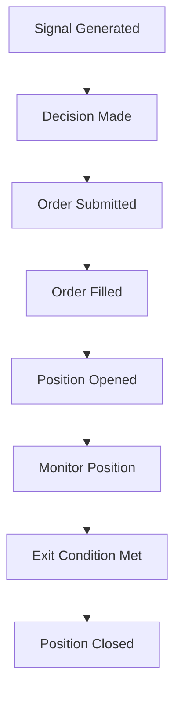

# Gaps Assessment for Live Trading Conversion

## Overview
This document identifies and prioritizes gaps in the current trading app that must be addressed before converting to live trading.

---

## Critical Gaps

### 1. Credentials Management
- **Issue**: API keys and secrets are not securely managed in the current implementation.
- **Impact**: Risk of exposing sensitive credentials in logs or configuration files.
- **Recommendation**: Use environment variables or a secrets manager to store and retrieve credentials securely.

### 2. Slippage and Fees Model
- **Issue**: The current slippage and fees model may not accurately reflect live market conditions.
- **Impact**: Inaccurate PnL calculations and risk management.
- **Recommendation**: Calibrate slippage and fees based on live market data and exchange-specific parameters.

### 3. Order Sizing and Compliance
- **Issue**: Order sizes may not comply with exchange-specific constraints (e.g., minimum order size, lot size).
- **Impact**: Orders may be rejected or partially filled, leading to unexpected behavior.
- **Recommendation**: Implement validation for order sizes based on exchange rules.

### 4. Kill Switch
- **Issue**: There is no kill switch mechanism to halt trading in emergencies.
- **Impact**: Potential for uncontrolled losses in case of system failures or market anomalies.
- **Recommendation**: Implement a kill switch that can be triggered manually or automatically based on predefined conditions.

---

## High Gaps

### 1. Monitoring and Alerting
- **Issue**: Limited monitoring and alerting capabilities for critical events (e.g., circuit breaker trips, large losses).
- **Impact**: Delayed response to issues, increasing the risk of losses.
- **Recommendation**: Set up email/Slack alerts for critical events and implement a monitoring dashboard.

### 2. Broker/Exchange API Differences
- **Issue**: The app may not fully account for differences between paper and live exchange APIs.
- **Impact**: Unexpected behavior or errors when switching to live trading.
- **Recommendation**: Test the app with live exchange APIs and adjust for any differences.

### 3. Environment Separation
- **Issue**: Paper and live environments are not fully isolated, increasing the risk of accidental live orders.
- **Impact**: Potential for unintended live trades during testing.
- **Recommendation**: Implement strict environment separation and validation to prevent accidental live orders.

---

## Medium Gaps

### 1. Data Validation
- **Issue**: Limited validation of market data for accuracy and completeness.
- **Impact**: Incorrect trading decisions based on flawed data.
- **Recommendation**: Implement data validation checks to ensure the integrity of market data.

### 2. Performance Optimization
- **Issue**: The app may not be optimized for low-latency execution in live markets.
- **Impact**: Slower execution and potential missed opportunities.
- **Recommendation**: Optimize the app for performance, focusing on reducing latency in order execution.

---

## Low Gaps

### 1. Documentation
- **Issue**: Documentation may be incomplete or outdated.
- **Impact**: Difficulty in onboarding new users or troubleshooting issues.
- **Recommendation**: Update and expand documentation to cover all aspects of the app, including setup, configuration, and troubleshooting.

### 2. User Interface
- **Issue**: The UI may not provide sufficient visibility into the app's state and performance.
- **Impact**: Reduced usability and difficulty in monitoring the app.
- **Recommendation**: Enhance the UI to provide better visibility into the app's state, performance, and logs.

---

## Next Steps

1. Address all **Critical** gaps before proceeding to live trading.
2. Prioritize **High** gaps based on their impact and feasibility.
3. Address **Medium** and **Low** gaps as resources allow.

---

## Recommendations

### Example Log Schema
```json
{
  "timestamp": "2026-01-17T19:42:31.487Z",
  "level": "INFO",
  "component": "trading.execution",
  "message": "PositionOpened",
  "meta": {
    "side": "LONG",
    "ts": "2026-01-17T19:42:31.487Z",
    "price": 45000.0,
    "quantity": 0.1,
    "stop": 44500.0,
    "tp": 46000.0
  }
}
```

### Example State Diagram


---

## Conclusion
Addressing these gaps will ensure a smooth and safe transition to live trading. Prioritize critical and high gaps first, and continue to refine the app based on feedback and testing results.
